# Stream It
Web-based streaming platform for video content.  

## Features
- User registration and authentication
- Role-based access control (Admin and Viewer)
- Upload and manage video content
- Stream videos with adaptive playback
- Search and filter video content
- Commenting and rating system (optional)
- Dashboard for admins to monitor platform activity

[](https://www.docker.com/)
[](https://laravel.com/)
[](https://vuejs.org/)


## Screenshots
<p float="center">
  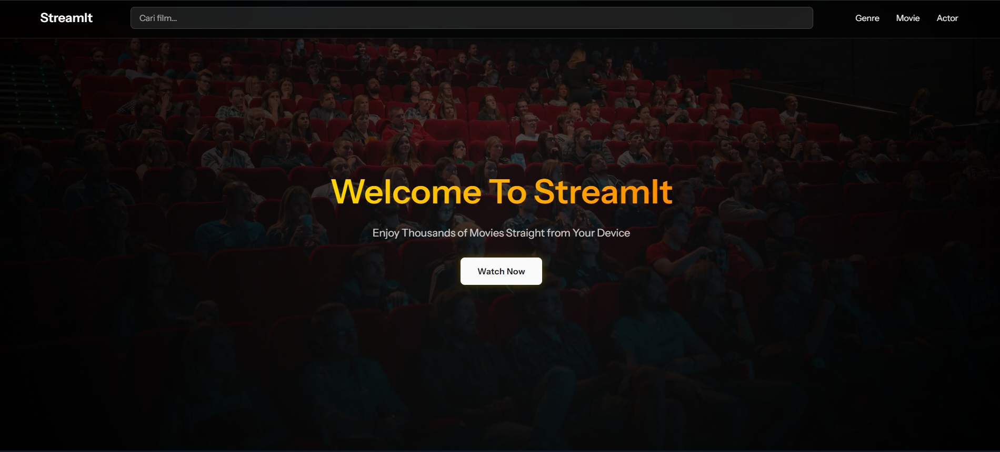
  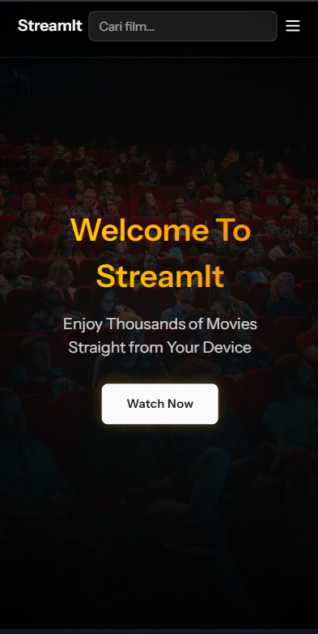
</p>
<p float="center">
  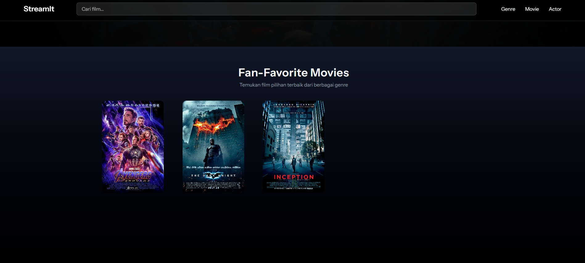
  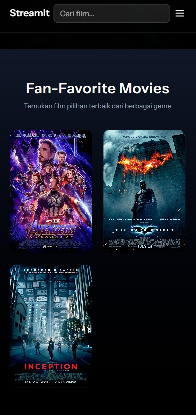
</p>

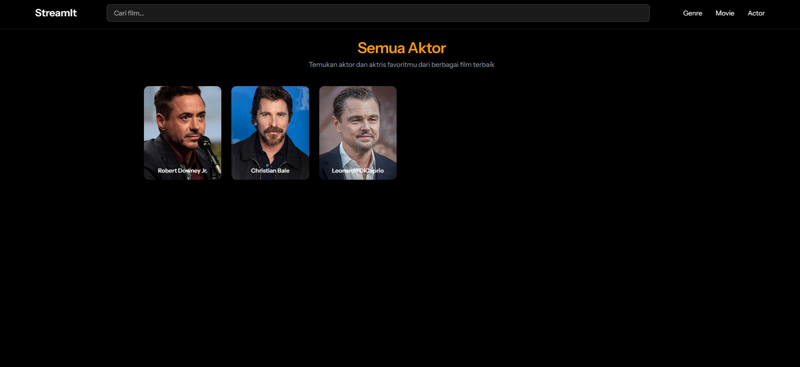
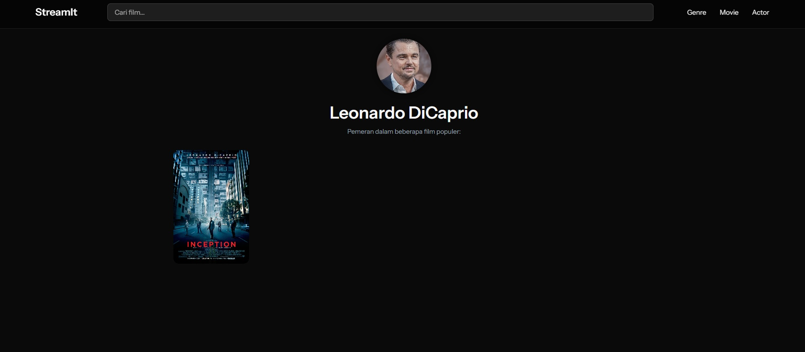
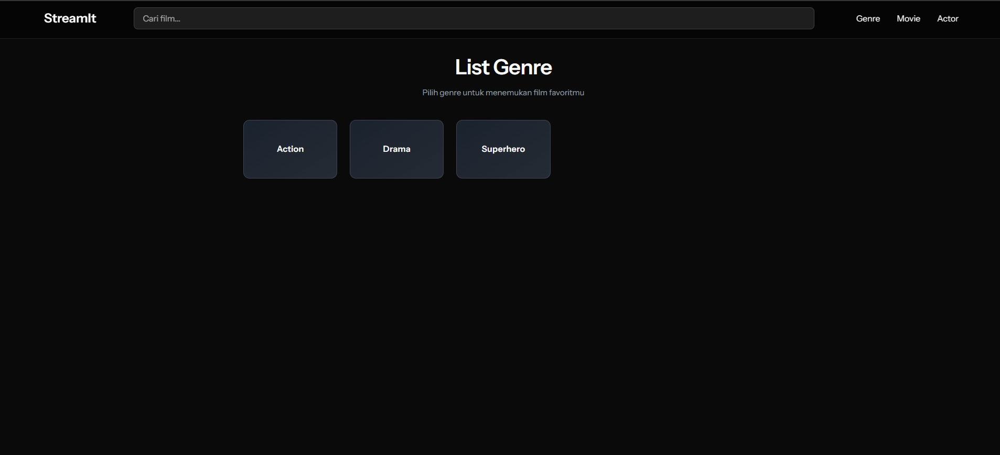
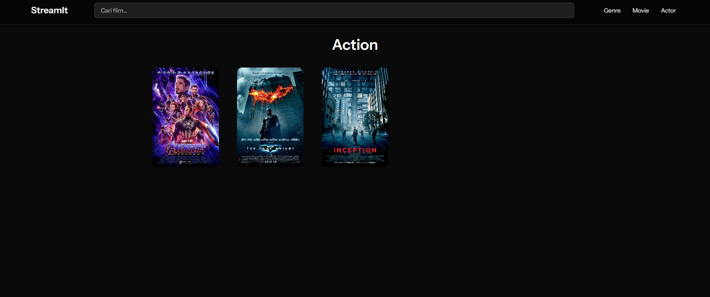

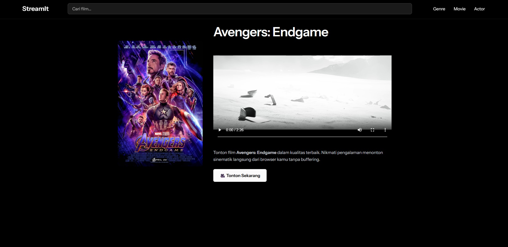

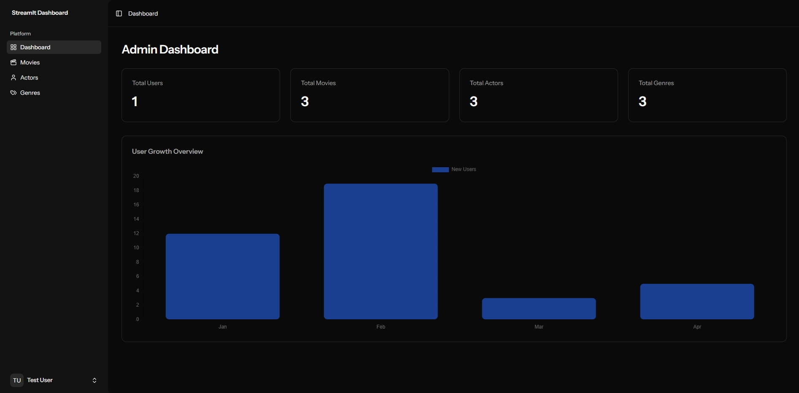
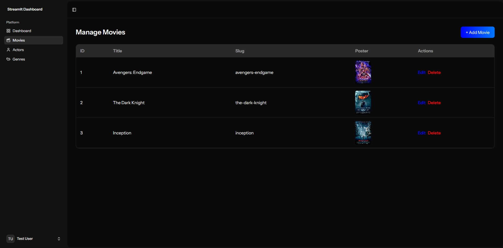

---

## Tech Stack

[](https://laravel.com/)
[](https://vuejs.org/)
[](https://www.docker.com/)

---

## Build and Development

### 1. Clone Repository
```bash
git clone https://github.com/username/stream-it.git
cd stream-it
```

### 2. Copy Environment File
```bash
cp .env.example .env
```

### 3. Generate Application Key
```bash
php artisan key:generate
```

### 4. Install Dependencies
```bash
composer install
npm install
npm run build
```

### 5. Run Migrations and Seeders
```bash
php artisan migrate --seed
```

### 6. Build and Run with Docker
```bash
docker-compose up -d --build
```

### 7. Access the Application
Visit `http://localhost:8000` (or your Docker host)

## Usage

1. Sign up or log in as a user/admin.
2. Browse and stream available videos.
3. Admins can upload and manage content.
4. Users can add videos to their Watchlist and manage preferences.

---

## Contributors

| Name | Role |
|------|------|
| Andhika Putratama | Developer & Project Owner |

## License

This project is licensed under the [MIT License](./LICENSE) — you are free to use, modify, and distribute it.
